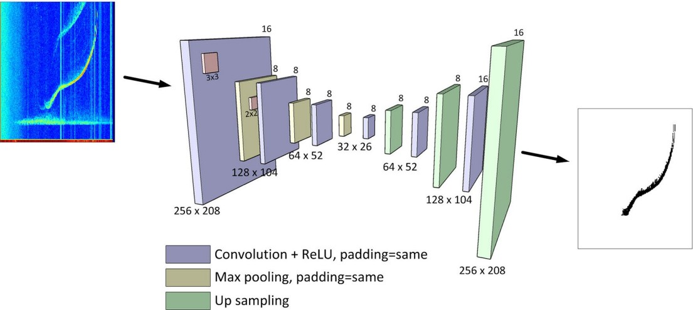

# Ionospheric Echo Detection Using Semantic Segmentation

We aim to replicate the experiments described in the paper "Ionospheric Echo Detection in Digital Ionograms Using
Convolutional Neural Networks" from the Advancing Earth and Space Science Journal submissions 2021.

This project was done in my last two weeks at the Radio Astronomy Institute as part of the pipiline for the processing of ionograms measured at the Jicamarca Observatory and Pontifical Catholic University of Peru. 

### Abstract
An ionogram is a graph of the time that a vertically transmitted wave takes to return to the
earth as a function of frequency. Time is typically represented as virtual height, which is the time divided
by the speed of light. The ionogram is shaped by making a trace of this height against the frequency of the
transmitted wave. Along with the echoes of the ionosphere, ionograms usually contain a large amount of
noise and interference of different nature that must be removed in order to extract useful information. In
the present work, we propose a method based on convolutional neural networks to extract ionospheric
echoes from digital ionograms. From the extracted traces, ionospheric parameters can be determined and
electron density profile can be derived.

### Encoder-Decoder Architecture
The encoder-decoder is widely used for a number of tasks, trace retrieval included. While the encoder learns or captures features of the image and low its spatial resolution while learning more abstract representations of the image, the decoder upsample the very packed tensor to the original image resolution for further data processing depending on the task. In our case, we want to extract the trace which at the end is nothing more than seeing what pixels are on and off. Then we use the `BCEWithLogitsLoss` loss function as it suits well for binary classification tasks.

  

### Data

The data consists of `.npz` files. They are masks, i.e. matrices, consisting of zeros and ones indicating noise, or an echo detection. The targets are the traces we want to retrieve. The original data set https://www.kaggle.com/datasets/cdelajara/ionograms is a bit unorganized so I had to curate it myself. You can find it in: 

- [original ionogram mask](https://drive.google.com/file/d/1N_gQyYZBL1HjNAJS7dITAPCiT5ZU-UlO/view?usp=sharing)
- [target maks](https://drive.google.com/file/d/1-74mrE-ZlC5HeRKVuaCp7ryTyS4RUfEj/view?usp=sharing)

### Results
The results are promising even without fintunning: 

   
   
   
  

### References
- [Ionospheric Echo Detection in Digital Ionograms Using Convolutional Neural Networks](https://agupubs.onlinelibrary.wiley.com/doi/full/10.1029/2020RS007258)
- [Fully Convolutional Networks for Semantic Segmentation](https://arxiv.org/pdf/1411.4038)
- [U-Net: Convolutional Networks for Biomedical Image Segmentation](https://arxiv.org/pdf/1505.04597)
